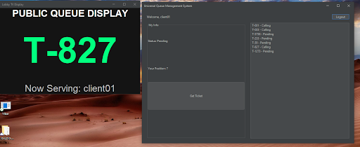
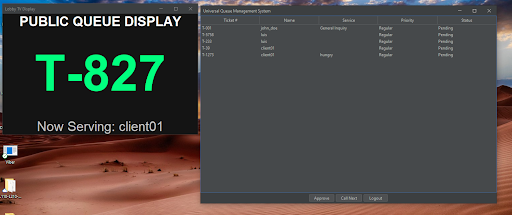
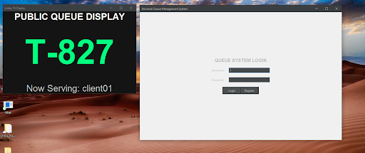

# Java Queue Management System
**[ ARCHIVE_01 ]**

I built a Queue Management System in Java that connects to a MySQL database. My main goal was to go beyond a simple app and learn about things like database security and UI design. I implemented BCrypt for password hashing because I wanted to learn how to handle user data safely. 

 
*Figure 1: The Public Queue Display featuring a modern dark-mode UI.*

### How it works:
- **For Clients:** Users can create an account and request a ticket for a consultation.
- **For Admins:** A dashboard to view all pending requests, approve them, and "Call Next."
- **Lobby Display:** A public screen designed for a TV or monitor that auto-refreshes to show the current ticket being served.
- **Voice Announcement:** When a ticket is called, the system announces the number out loud (e.g., "Now serving ticket T 1 0 1").

*Figure 2: The Admin Management Center for real-time queue handling.*

### Technical Implementation:
- **Backend:** Java 21 (Modular Project)
- **Database:** MySQL 8.0
- **UI Framework:** Java Swing + **FlatLaf** (Modern Dark Mode)
- **Security:** **jBCrypt** (Password hashing)
- **Architecture:** Used a **Singleton pattern** for the `QueueManager` to centralize all SQL logic and database connections.

### Development Notes & Lessons
- **Modular Java:** This project uses `module-info.java`. Figuring out how to manage external JAR dependencies like the MySQL connector and FlatLaf within a modular environment was a major part of the learning process.
- **Separation of Concerns:** I refactored the code to move SQL queries out of the UI panels and into a manager class. This made the project much easier to debug and maintain.
- **Threading:** I learned that features like voice announcements or auto-refreshing timers need to run on separate threads so they don't freeze the main User Interface.
- **Security Growth:** I initially had passwords stored as plain text, but I updated the system to use salted BCrypt hashes to meet modern security standards.

*Figure 3: Secure authentication gateway using BCrypt encryption.*

### Setup
1. Import the `queue_system` schema into MySQL.
2. Add the JAR files in the `/lib` folder to your project's Modulepath.
3. Run `Main.java` to start the app.

---
**Developer:** Luis  
**Role:** System-Building Data Scientist  
**Project Status:** Recruiter-Ready
